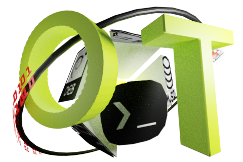
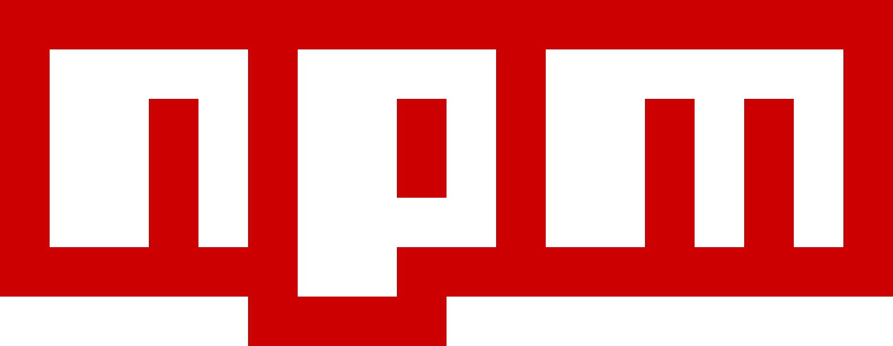

|  |  |
|:-----------------------------------------------------------:| ------------------------------------------------------ |

# node-yss

Yss as a part of oiyshTerminal hosted in nodejs. So it's possible to get assets by npm.

### part of a oiyshTerminal

Using esential part of oiyshTerminal *yss*. It's a set of html, js, and other got files to be hosted as a set of helping tool.

*site* - is like screen with it's own approach. It can be Html, svg, obj, gbl, ...

...

more is coming

....

### Information

* others site's in viteyss [list of tags ...](https://github.com/topics/viteyss-site-)

* how to host it? [link to old wiki ....](https://github.com/yOyOeK1/viteyss)

* how to create your own site from template [link to github...](https://github.com/yOyOeK1/viteyss-siteCreateClone)

**older stuff**

* what is yss? [link to old wiki ....](https://github.com/yOyOeK1/oiyshTerminal/wiki/otdm-yss)

* how to add sites [link to wiki...](https://github.com/yOyOeK1/oiyshTerminal/wiki/yss-site-example)

---

If you see that this makes sense [ send me a ☕ ](https://ko-fi.com/B0B0DFYGS) | [Master repository](https://github.com/yOyOeK1/oiyshTerminal) | [About SvOiysh](https://www.youtube.com/@svoiysh)